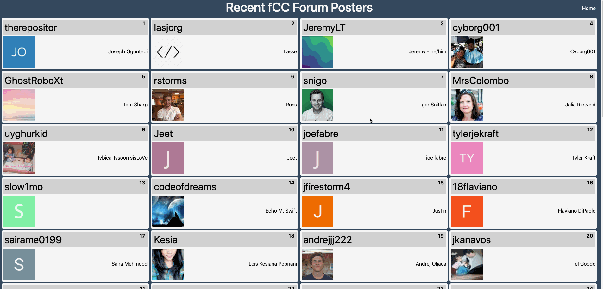
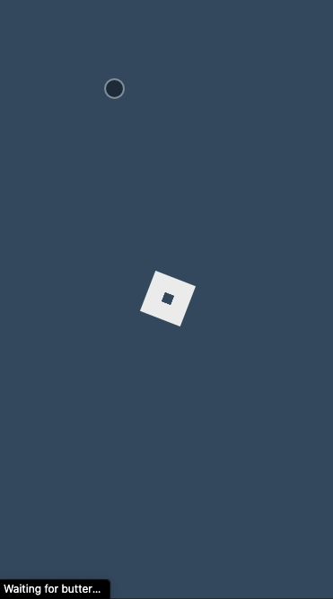

# freeCodeCamp React.JS leaderboard

This is my leaderboard, created using React, Bootstrap & HTML as one of the projects to freeCodeCamp's data visualization program.

   
   

## Getting Started

Host locally after download or check out the one hosted on my site [Leaderboard](http://www.spazcool.com/leaderboard/)

### Prerequisites

A browser and an internet connection is all you'll need.

### Installing

No installation required.

## Built With

* React
* HTML
* CSS

## Authors

* **Douglas Wright** - [Spazcool](https://github.com/Spazcool)

## License

This project is licensed under the MIT License - see the [LICENSE.md](LICENSE.md) file for details

## Acknowledgments
* **Daniel Hearn** - [Daniel Hearn](https://github.com/DanielHearn), for the CSS loader
